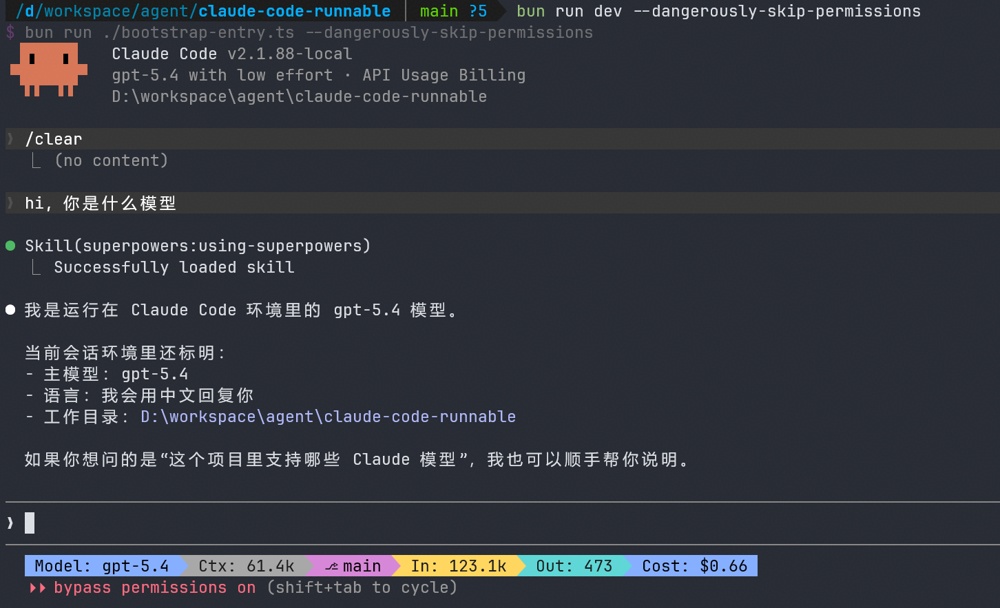

# Claude Code Runnable

<p align="right"><strong>English</strong> | <a href="./README.md">中文</a></p>

A buildable and runnable source project reconstructed from the `@anthropic-ai/claude-code@2.1.88` npm package (with `cli.js.map`). Runtime is Bun. **Zero modifications to any original `src/` or `vendor/` files.**

> The leaked source code cannot run directly — it is missing build configs, type stubs, native module shims, and resource files. This repository fills those gaps with ~90 new files while keeping the original 1,884 source files untouched.



## Architecture & Internals Documentation

Deep dive into Claude Code's architecture, implementation details, and core mechanisms:

### Foundation & Architecture (Chapters 1-4)

| # | Document | Description |
|---|----------|-------------|
| 1 | [Foundation](docs/en/01_foundation.md) | Project overview, tech stack, directory structure, dependency graph, and quick-start guidance |
| 2 | [Architecture](docs/en/02_architecture.md) | Layered architecture, entry points, React/Ink rendering, message flow, and state management |
| 3 | [Workflow](docs/en/03_workflow.md) | User interaction loop, conversation lifecycle, streaming responses, tool execution chain, and context compaction triggers |
| 4 | [Core Mechanisms](docs/en/04_core_mechanisms.md) | Message formats, serialization, token counting, cost tracking, conversation history, and config merging |

### Module Deep Dive (Chapters 5-10)

| # | Document | Description |
|---|----------|-------------|
| 5 | [Tool System](docs/en/05_module_tool_system.md) | Tool base design, tool taxonomy, registration and execution pipeline, input validation, and output normalization |
| 6 | [Permission System](docs/en/05_module_permission.md) | Permission engine, rule matching, authorization dialogs, sandbox isolation, and security tiers |
| 7 | [Agent System](docs/en/05_module_agent.md) | Sub-agent lifecycle, task dispatch, async management, and result aggregation |
| 8 | [MCP Integration](docs/en/05_module_mcp.md) | Model Context Protocol client and server implementation, tool bridging, resource access, and socket pooling |
| 9 | [Bridge Layer](docs/en/05_module_bridge.md) | Communication with Claude Web, Bridge client architecture, message serialization, and connection management |
| 10 | [Context & Memory](docs/en/05_module_context.md) | Context window strategy, compaction, memory persistence, and onboarding state detection |

### Summary & Evaluation (Chapters 11-12)

| # | Document | Description |
|---|----------|-------------|
| 11 | [Native Modules](docs/en/06_native_modules.md) | Native binary distribution, Sharp image pipeline, ripgrep integration, audio capture, and cross-platform adaptation |
| 12 | [Evaluation](docs/en/07_evaluation.md) | Architectural strengths and weaknesses, design review, scalability analysis, comparisons, and recommendations |

[View full index →](docs/en/index.md)

## Features

- **Zero source modifications** — all original `src/` and `vendor/` files are untouched; every fix is an additive new file
- **Full build system** — `bun run build` produces a 19.5MB single-file bundle (`dist/cli.js`)
- **Complete Ink TUI** — the full interactive terminal UI works, identical to official Claude Code
- **Headless mode** — `--print` / `--output-format` for scripting and CI
- **Feature flags** — compile-time flags via `bun:bundle` polyfill, toggle in a single config file
- **Cross-platform** — works on macOS, Linux, and Windows (Git Bash required on Windows)

## Quick Start

### 1. Install Bun

This project requires [Bun](https://bun.sh) as its runtime.

```bash
# macOS / Linux
curl -fsSL https://bun.sh/install | bash

# macOS (Homebrew)
brew install bun

# Windows (PowerShell)
powershell -c "irm bun.sh/install.ps1 | iex"
```

### 2. Install dependencies

```bash
bun install
```

### 3. Configure environment

```bash
cp .env.example .env
# Edit .env and set your ANTHROPIC_API_KEY
```

### 4. Run

```bash
# Interactive TUI mode
bun run dev

# Headless mode (single prompt)
bun run dev -- -p "hello" --output-format text

# Check version
bun run dev -- --version
# => 2.1.88-local (Claude Code)
```

### 5. Build (optional)

```bash
bun run build
bun dist/cli.js --version
```

## Project Structure

```
claude-code-runnable/
├── bootstrap-entry.ts      # Entry point (sets MACRO globals -> imports cli.tsx)
├── preload.ts              # Bun preload plugin (bun:bundle polyfill)
├── config/
│   └── features.ts         # Single source of truth for feature flags & plugin
├── bunfig.toml             # Bun config (loads preload.ts)
├── package.json            # Dependencies & scripts (dev/start/build)
├── tsconfig.json           # TypeScript config
├── .env.example            # Environment variable template
├── scripts/
│   └── build.ts            # Bun build script (externals + define + plugin)
├── src/                    # Original restored TS/TSX source (1,884 files)
│   ├── entrypoints/cli.tsx # Real CLI entry point
│   ├── stubs/              # bun-bundle.d.ts type declaration
│   └── ...
├── vendor/                 # 4 native module TS binding layers
├── shims/                  # 7 stub packages (file: protocol references)
│   ├── @ant/claude-for-chrome-mcp/
│   ├── @ant/computer-use-mcp/
│   ├── @ant/computer-use-swift/
│   ├── @ant/computer-use-input/
│   ├── color-diff-napi/
│   ├── modifiers-napi/
│   └── url-handler-napi/
└── dist/                   # Build output (bun run build)
    └── cli.js              # ~19.5MB single-file bundle
```

## Changes From Original Source

All changes are **additive new files** — zero modifications to existing source files.

### Root Config Files (9 files)

| File | Purpose |
|------|---------|
| `package.json` | Dependencies, scripts (`dev`/`start`/`build`/`typecheck`) |
| `tsconfig.json` | TypeScript config with `bun:bundle` path alias |
| `bunfig.toml` | Bun preload config |
| `preload.ts` | Bun plugin polyfilling `bun:bundle` feature flags at runtime |
| `bootstrap-entry.ts` | Sets `globalThis.MACRO` with env overrides, imports CLI |
| `config/features.ts` | Single source of truth for feature flag set & plugin factory |
| `scripts/build.ts` | Bun build script with externals list & MACRO defines |
| `.env.example` | Environment variable template |
| `src/stubs/bun-bundle.d.ts` | TypeScript type declaration for `bun:bundle` |

### Shim Packages (7 packages, 16 files)

Local `file:` protocol packages replacing missing Anthropic-internal and native modules:

| Package | Strategy |
|---------|----------|
| `@ant/claude-for-chrome-mcp` | MCP server stub with tool catalog |
| `@ant/computer-use-mcp` | Full type system + session flow shim (22 tools) |
| `@ant/computer-use-swift` | 297-line stub, partially functional on macOS |
| `@ant/computer-use-input` | Input API stub with platform detection |
| `color-diff-napi` | Re-exports from `src/native-ts/` TypeScript port |
| `modifiers-napi` | Re-exports from `vendor/` TS binding |
| `url-handler-napi` | Re-exports from `vendor/` TS binding |

### SDK & Type Stubs (4 files)

| File | Purpose |
|------|---------|
| `src/entrypoints/sdk/coreTypes.generated.ts` | SDK message types |
| `src/entrypoints/sdk/runtimeTypes.ts` | SDK runtime types (15 types) |
| `src/entrypoints/sdk/settingsTypes.generated.ts` | SDK settings type |
| `src/entrypoints/sdk/toolTypes.ts` | SDK tool definition type |

### Tool Stubs (6 files)

| File | Strategy |
|------|----------|
| `src/tools/TungstenTool/TungstenTool.ts` | Disabled tool (isEnabled=false) |
| `src/tools/TungstenTool/TungstenLiveMonitor.tsx` | Null React component |
| `src/tools/WorkflowTool/constants.ts` | Tool name constant |
| `src/tools/REPLTool/REPLTool.ts` | `null` export (feature-gated) |
| `src/tools/SuggestBackgroundPRTool/` | `null` export (feature-gated) |
| `src/tools/VerifyPlanExecutionTool/` | `null` export (feature-gated) |

### Feature-Gated Service Stubs (7 files)

No-op implementations for features behind compile-time flags:

| File | Gating Flag |
|------|-------------|
| `src/services/compact/cachedMicrocompact.ts` | `CACHED_MICROCOMPACT` |
| `src/services/compact/snipCompact.ts` | `HISTORY_SNIP` |
| `src/services/compact/snipProjection.ts` | `HISTORY_SNIP` |
| `src/services/contextCollapse/index.ts` | `CONTEXT_COLLAPSE` |
| `src/services/contextCollapse/operations.ts` | `CONTEXT_COLLAPSE` |
| `src/services/contextCollapse/persist.ts` | `CONTEXT_COLLAPSE` |
| `src/localRecoveryCli.ts` | Standalone recovery CLI |

### Component & Command Stubs (6 files)

| File | Purpose |
|------|---------|
| `src/components/agents/SnapshotUpdateDialog.tsx` | Null React component |
| `src/assistant/AssistantSessionChooser.tsx` | Null React component |
| `src/commands/assistant/assistant.ts` | Empty assistant command |
| `src/commands/assistant/index.ts` | Re-export barrel |
| `src/commands/agents-platform/index.ts` | Empty command array |
| `src/utils/protectedNamespace.ts` | Returns false |

### Other Resource Files (7 files)

| File | Purpose |
|------|---------|
| `src/ink/devtools.ts` | Empty module (fire-and-forget import) |
| `src/ink/global.d.ts` | Empty ambient declaration |
| `src/types/connectorText.ts` | Connector text block types |
| `src/utils/filePersistence/types.ts` | File persistence constants & interfaces |
| `src/utils/ultraplan/prompt.txt` | Planning prompt resource |
| `src/utils/permissions/yolo-classifier-prompts/` | 3 classifier prompt files |

### Skill Files (29 files)

| Directory | Content |
|-----------|---------|
| `src/skills/bundled/claude-api/` | 26 files — API usage examples (Python, Go, Java, etc.) |
| `src/skills/bundled/verify/` | 3 files — Verification skill |

## Known Limitations

- **Native modules** (audio-capture, image-processor) have no original Rust/C++ source; shims provide graceful fallbacks
- **Feature-flagged features** (VOICE_MODE, BRIDGE_MODE, COORDINATOR_MODE, etc.) are disabled by default; enabling them may require additional stubs
- **No test files** — the original bundle did not include tests
- **Anthropic-internal features** (`USER_TYPE === 'ant'`) are empty stubs (REPLTool, agents-platform, etc.)
- **Commander v12** — downgraded from v14 for multi-char short flag compatibility (`-d2e`)

## Disclaimer

This repository is based on the Claude Code source code leaked from the Anthropic npm registry on 2026-03-31. All original source code is copyrighted by [Anthropic](https://www.anthropic.com). For learning and research purposes only.
