# Claude Code — Comprehensive Architecture Analysis

> **Codebase**: ~1,884 TypeScript/TSX files | **Runtime**: Bun | **UI**: React + Custom Ink Fork | **API**: Anthropic SDK

---

## Table of Contents

1. [High-Level Architecture](#1-high-level-architecture)
2. [Startup & Initialization](#2-startup--initialization)
3. [Query Engine — The Agentic Core Loop](#3-query-engine--the-agentic-core-loop)
4. [Tool System](#4-tool-system)
5. [Terminal UI — Custom Ink Fork](#5-terminal-ui--custom-ink-fork)
6. [State Management](#6-state-management)
7. [Multi-Agent & Coordinator Architecture](#7-multi-agent--coordinator-architecture)
8. [Services Layer](#8-services-layer)
9. [Command System](#9-command-system)
10. [Permission System](#10-permission-system)
11. [Context Management & Compaction](#11-context-management--compaction)
12. [Bridge & Remote Sessions](#12-bridge--remote-sessions)
13. [Skills & Plugin System](#13-skills--plugin-system)
14. [Key Design Patterns](#14-key-design-patterns)

---

## 1. High-Level Architecture

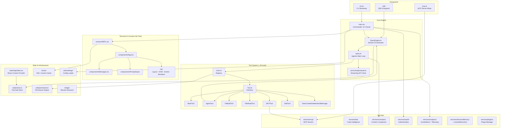

### Layer Summary

| Layer | Key Files | Role |
|-------|-----------|------|
| **Entrypoints** | `cli.tsx`, `main.tsx`, `sdk/`, `mcp.ts` | Bootstrap, arg parsing, mode routing |
| **Core Engine** | `QueryEngine.ts`, `query.ts` | Agentic loop, message management, tool dispatch |
| **API Client** | `services/api/claude.ts`, `withRetry.ts` | Streaming, retry, fallback, auth |
| **Tool System** | `Tool.ts`, `tools.ts`, `tools/*/` | 40+ tools with permission-aware execution |
| **Terminal UI** | `ink/`, `screens/`, `components/` | Custom React-for-terminal rendering engine |
| **State** | `state/`, `context/` | Pub-sub store with React context providers |
| **Services** | `services/*/` | MCP, LSP, OAuth, analytics, compaction, memory |
| **Infrastructure** | `hooks/`, `utils/`, `bridge/`, `tasks/` | Permissions, config, remote bridge, background tasks |

---

## 2. Startup & Initialization

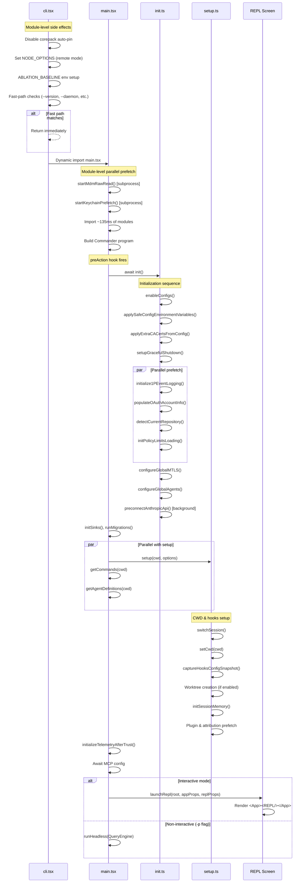

### Startup Optimization Techniques

| Technique | Details |
|-----------|---------|
| **Module-level prefetch** | MDM reads + keychain reads fire as subprocesses *during* import evaluation (~135ms overlap) |
| **Fast paths** | `--version` exits with zero imports; `--daemon`, `--bg` skip full CLI |
| **Deferred telemetry** | OpenTelemetry SDK (~400KB) loaded only after trust dialog |
| **Parallel init** | OAuth, repo detection, policy limits, 1P logging all run concurrently |
| **API preconnect** | TCP+TLS handshake starts before any user interaction |
| **Feature flag DCE** | `bun:bundle` `feature()` gates eliminate dead code at build time |
| **Memoized init** | `init()` is memoized — safe to call multiple times |

---

## 3. Query Engine — The Agentic Core Loop

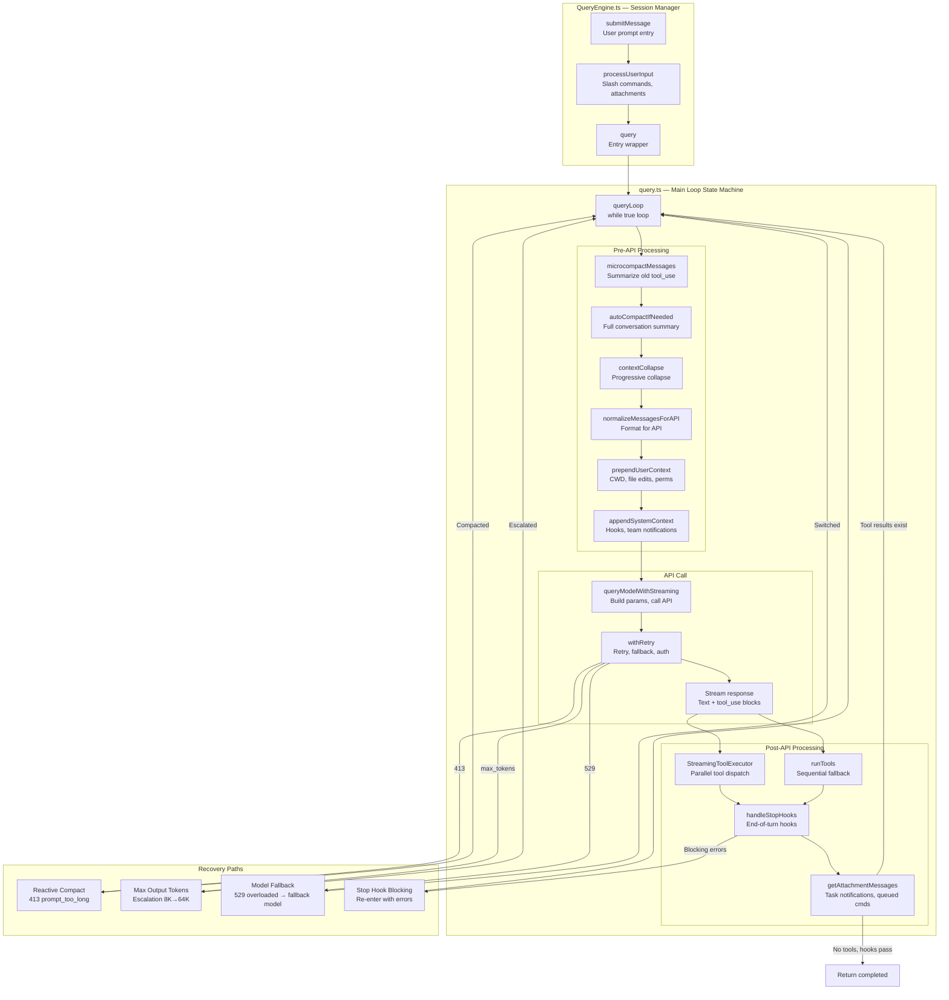

### Single Turn Data Flow

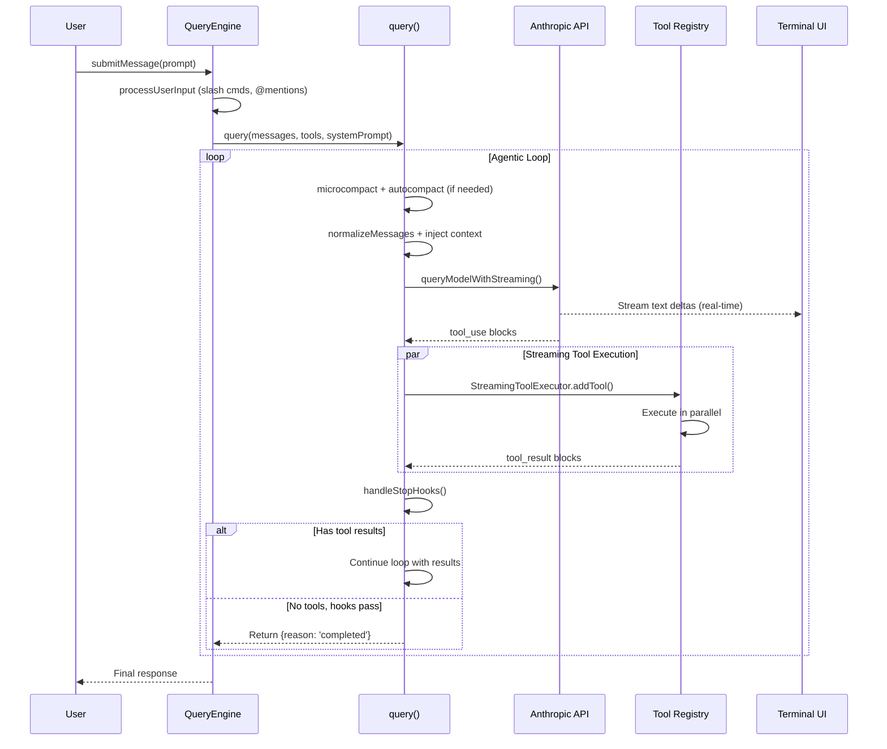

### Token Budget & Context Management

| Mechanism | Trigger | Action |
|-----------|---------|--------|
| **Micro-compact** | Per-turn, old tool_use blocks | Summarize via cache editing |
| **Auto-compact** | Token count > (contextWindow - 13K) | Fork agent to summarize full conversation |
| **Context collapse** | Feature-gated progressive | Collapse old message sections |
| **Reactive compact** | 413 from API | Emergency full-conversation summary |
| **Max output recovery** | Stop reason = max_tokens | Escalate 8K→64K, then retry with recovery message |
| **Token budget** | SDK budget limit (90% threshold) | Inject nudge message, then stop |

### API Retry Strategy

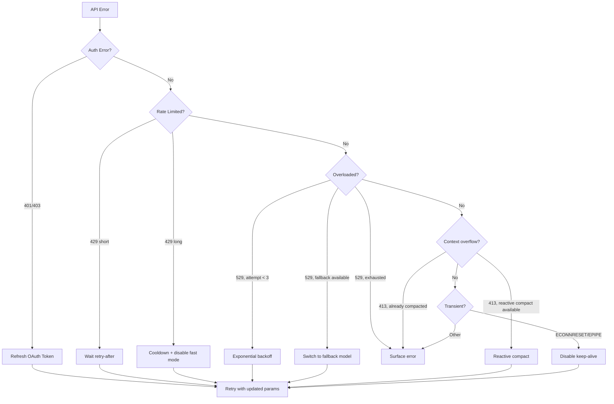

---

## 4. Tool System

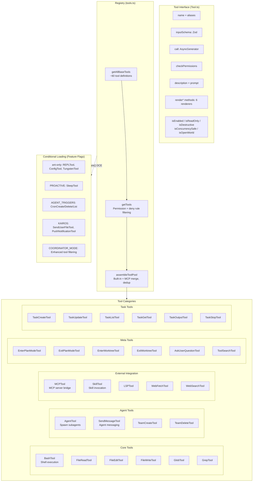

### Tool Execution Lifecycle

```mermaid
sequenceDiagram
    participant Loop as Query Loop
    participant Orch as Tool Orchestration
    participant Perm as Permission Engine
    participant Tool as Tool Implementation
    participant Hook as Hook System

    Loop->>Orch: runTools(toolUseBlocks)

    Orch->>Orch: partitionToolCalls<br/>(serial vs concurrent batches)

    loop Each batch
        loop Each tool in batch
            Orch->>Tool: validateInput(input)
            alt Invalid
                Orch-->>Loop: Error result
            end

            Orch->>Hook: Pre-tool-use hooks
            Orch->>Perm: checkPermissions(input, context)

            alt Denied
                Orch-->>Loop: Rejection result
            else Ask user
                Orch->>Perm: Prompt user
            end

            Orch->>Tool: call(input, context)
            Tool-->>Orch: Yield progress updates
            Tool-->>Orch: Final result

            Orch->>Hook: Post-tool-use hooks

            alt Result > maxResultSizeChars
                Orch->>Orch: Persist to disk, return preview
            end
        end
    end

    Orch-->>Loop: All tool results + context modifiers
```

### Tool Concurrency Model

```
Input: [BashTool(write), GlobTool, GrepTool, FileEditTool, GlobTool]

Partition into batches:
  Batch 1: [BashTool(write)]       → Serial (non-read-only)
  Batch 2: [GlobTool, GrepTool]    → Concurrent (both read-only)
  Batch 3: [FileEditTool]          → Serial (non-read-only)
  Batch 4: [GlobTool]              → Concurrent (read-only)

Max concurrency: CLAUDE_CODE_MAX_TOOL_USE_CONCURRENCY (default 10)
```

---

## 5. Terminal UI — Custom Ink Fork

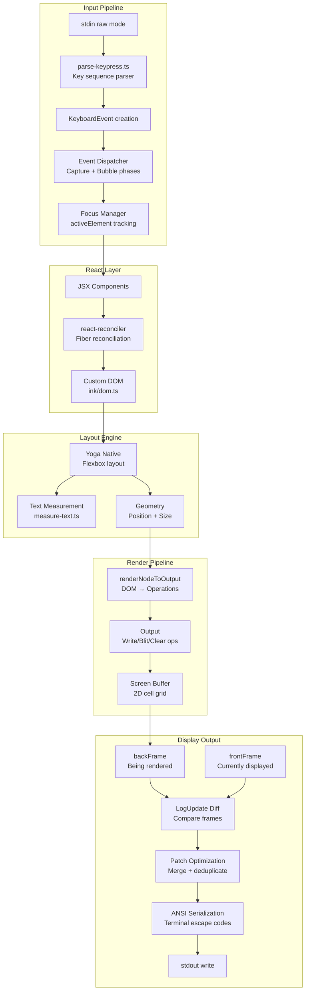

### Component Hierarchy

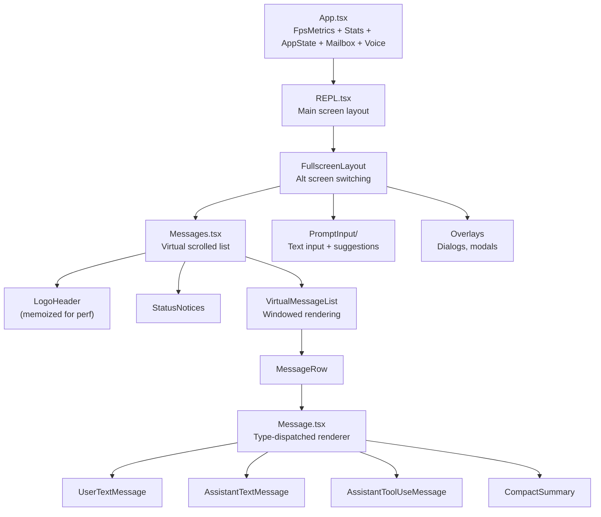

### Rendering Optimizations

| Optimization | Description |
|-------------|-------------|
| **Double buffering** | frontFrame/backFrame swap prevents flicker |
| **Blit optimization** | Unchanged regions copied from previous screen (avoid full redraw) |
| **Patch merging** | Consecutive ANSI writes merged to reduce I/O |
| **Style pooling** | Deduplicated style objects (CharPool, StylePool, HyperlinkPool) |
| **Scroll draining** | `SCROLL_MAX_PER_FRAME` rows animated per frame for smooth scroll |
| **60fps throttle** | `scheduleRender` throttled to 16.67ms intervals |
| **Logo memoization** | LogoHeader memoized to prevent dirty cascade in large sessions |
| **Layout shift detection** | Only full-redraw when Yoga dimensions actually change |

---

## 6. State Management

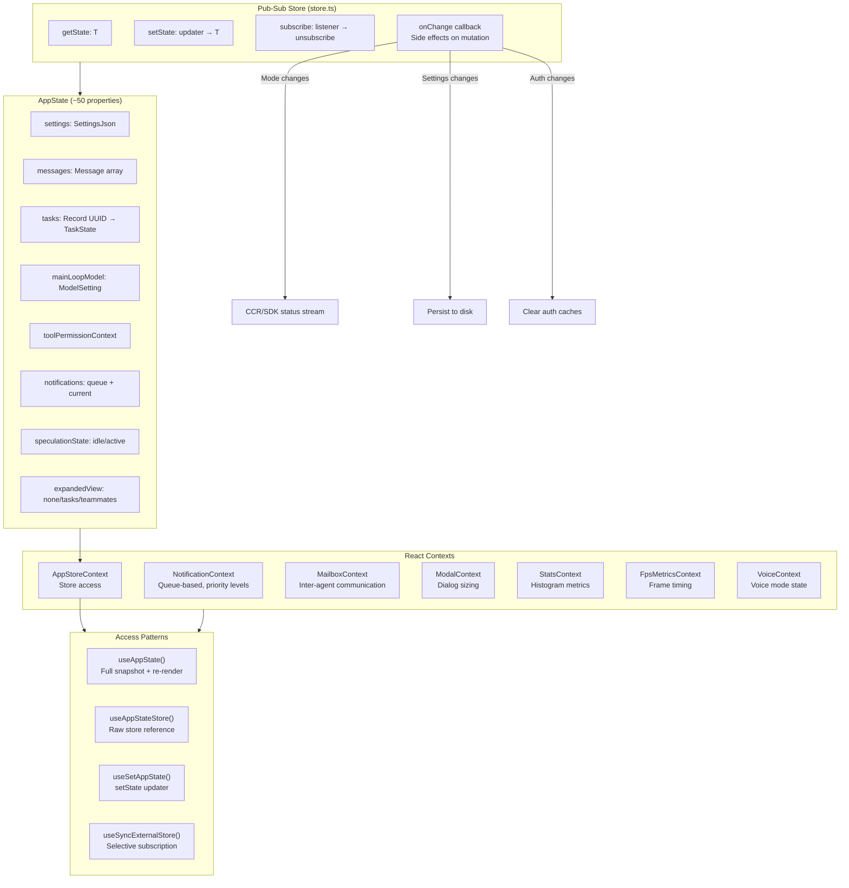

---

## 7. Multi-Agent & Coordinator Architecture

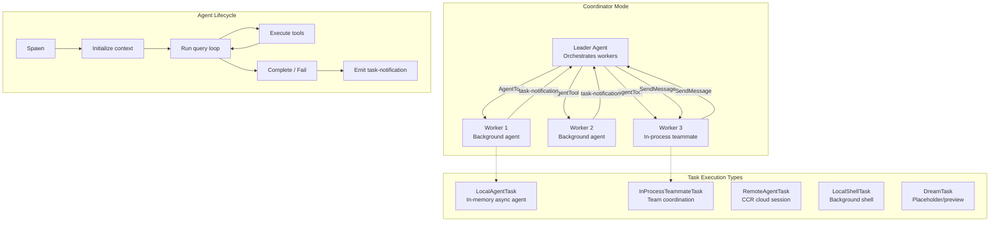

### Agent Spawning Modes

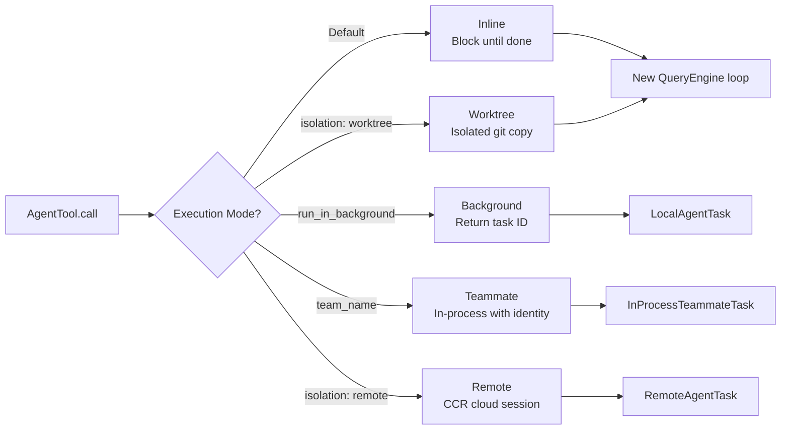

### Inter-Agent Communication

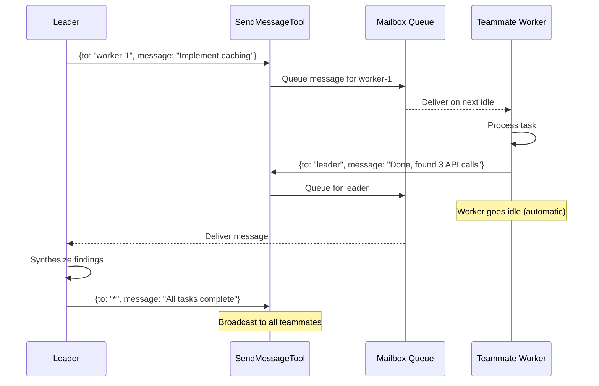

---

## 8. Services Layer

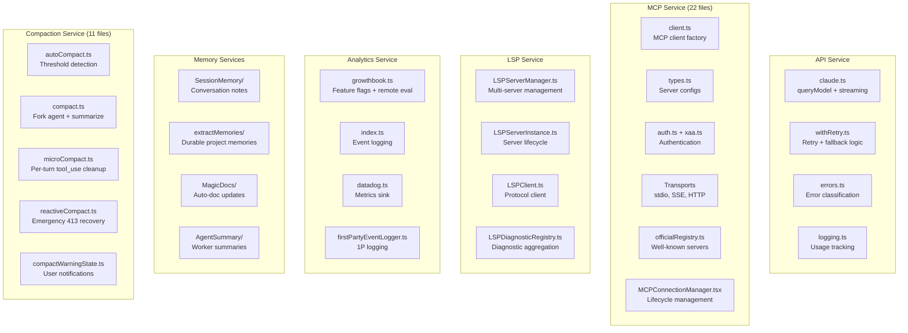

### Memory Service Architecture

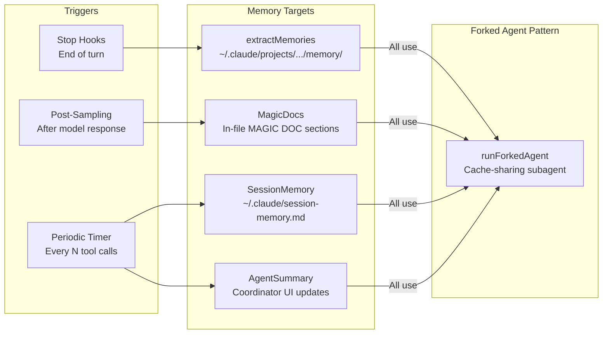

---

## 9. Command System

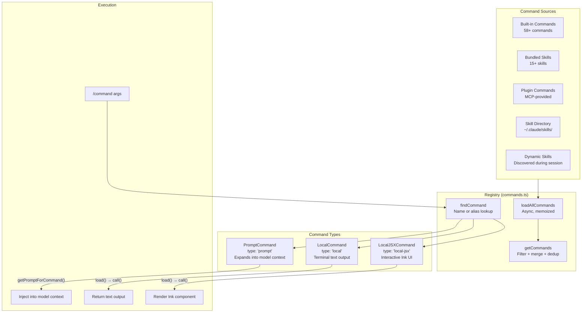

### Command Catalog (100+ commands)

| Category | Examples |
|----------|---------|
| **Git** | `/commit`, `/branch`, `/diff`, `/pr_comments`, `/review` |
| **Session** | `/compact`, `/clear`, `/resume`, `/export`, `/share` |
| **Navigation** | `/files`, `/context`, `/stats`, `/cost`, `/usage` |
| **Tools** | `/mcp`, `/hooks`, `/permissions`, `/plugins`, `/skills` |
| **Configuration** | `/config`, `/model`, `/theme`, `/vim`, `/voice` |
| **Development** | `/debug-tool-call`, `/doctor`, `/env`, `/sandbox-toggle` |
| **Agent** | `/agents`, `/tasks`, `/teleport` |
| **UI** | `/help`, `/keybindings`, `/statusline`, `/output-style` |

---

## 10. Permission System

```mermaid
graph TB
    subgraph Modes["Permission Modes"]
        DEFAULT["default<br/>Ask on suspicious"]
        ACCEPT["acceptEdits<br/>Auto-approve file writes"]
        BYPASS["bypassPermissions<br/>Auto-allow all"]
        DONTASK["dontAsk<br/>Auto-deny suspicious"]
        PLAN["plan<br/>Require plan approval"]
        AUTO["auto<br/>ML classifier decides"]
    end

    subgraph Rules["Rule Sources (Priority Order)"]
        CLI_R["CLI args<br/>--allow/--deny"]
        POLICY["Policy settings<br/>Org-wide"]
        USER["User settings<br/>~/.claude/settings.json"]
        PROJECT["Project settings<br/>.claude/settings.json"]
        SESSION["Session grants<br/>Temporary"]
    end

    subgraph Decision["Decision Flow"]
        INPUT[Tool input] --> VALIDATE[validateInput]
        VALIDATE --> HOOKS3[Pre-tool-use hooks]
        HOOKS3 --> CHECK[checkPermissions]
        CHECK --> MATCH{Rule match?}

        MATCH -->|"Allow rule"| ALLOW[Execute tool]
        MATCH -->|"Deny rule"| DENY[Block tool]
        MATCH -->|"No match"| MODE{Permission mode?}

        MODE -->|"bypass"| ALLOW
        MODE -->|"dontAsk"| CLASSIFY{Read-only?}
        CLASSIFY -->|"Yes"| ALLOW
        CLASSIFY -->|"No"| DENY
        MODE -->|"auto"| ML[ML Classifier]
        ML --> ALLOW & DENY & ASK
        MODE -->|"default"| ASK[Prompt user]
    end

    subgraph Classifiers["Classifiers"]
        BASH_CL[bashClassifier<br/>Command analysis]
        YOLO_CL[yoloClassifier<br/>Dangerous pattern detection]
        TRANS_CL[transcriptClassifier<br/>ML-based (feature-gated)]
    end

    ASK --> Classifiers
```

### Permission Rule Format

```
Tool: Bash(git commit *)     → Allow git commits
Tool: Bash(rm -rf *)         → Deny recursive deletes
Tool: FileEdit(src/**)       → Allow edits under src/
Tool: MCPTool(mcp__notion__*)→ Allow all Notion MCP tools
```

---

## 11. Context Management & Compaction

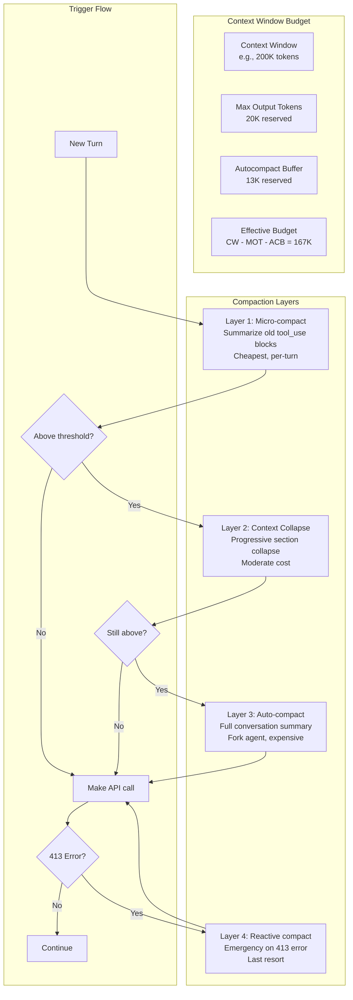

### Compaction Process

```mermaid
sequenceDiagram
    participant Loop as Query Loop
    participant AC as Auto-Compact
    participant Fork as Forked Agent
    participant API as Anthropic API

    Loop->>AC: calculateTokenWarningState()
    AC-->>Loop: isAboveAutoCompactThreshold = true

    Loop->>Fork: runForkedAgent(CompactSystemPrompt)
    Fork->>API: Summarize conversation (with cache sharing)
    API-->>Fork: Summary response
    Fork-->>Loop: compactionResult

    Loop->>Loop: buildPostCompactMessages()
    Note over Loop: Summary + file restorations (5 files)<br/>+ skill injections (5 skills)<br/>+ MCP instructions delta

    Loop->>Loop: Insert CompactBoundaryMessage
    Loop->>Loop: Reset tracking, continue loop
```

---

## 12. Bridge & Remote Sessions

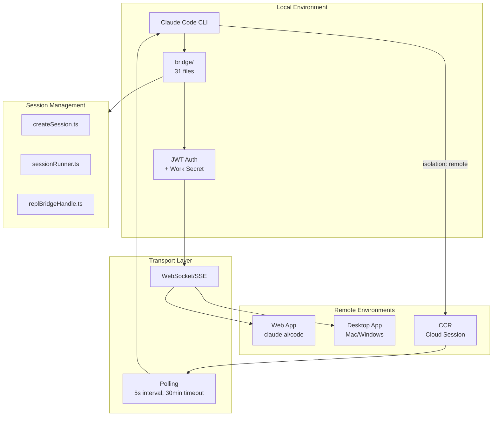

### Bridge Modes

| Mode | Description |
|------|-------------|
| `single-session` | One remote session per bridge |
| `worktree` | Isolated git worktree per session |
| `same-dir` | Shared directory, multiple sessions |

---

## 13. Skills & Plugin System

```mermaid
graph TB
    subgraph Skills["Skill System"]
        BS[bundledSkills.ts<br/>15+ compiled skills]
        LS[loadSkillsDir.ts<br/>Dynamic loading]
        MSB[mcpSkillBuilders.ts<br/>MCP-provided skills]

        subgraph Bundled["Bundled Skills"]
            BATCH[batch.ts]
            CLAUDE_API[claudeApi.ts]
            LOOP2[loop.ts]
            SIMPLIFY[simplify.ts]
            VERIFY[verify.ts]
            REMEMBER[remember.ts]
            SKILLIFY[skillify.ts]
            CONFIG2[updateConfig.ts]
        end
    end

    subgraph Plugins["Plugin System"]
        BP[builtinPlugins.ts<br/>Default plugins]
        PIM[PluginInstallationManager.ts<br/>Background install]
        PMK[Marketplace<br/>Reconciliation]
    end

    subgraph Loading["Loading Pipeline"]
        INIT2[Startup] --> BS
        INIT2 --> BP
        BS --> REG2[Register in command registry]
        LS --> REG2
        MSB --> REG2
        BP --> MCP2[Connect MCP servers]
        MCP2 --> MSB
    end

    subgraph Invocation["Skill Invocation"]
        USER2["/skill-name args"]
        USER2 --> FIND2[findCommand]
        FIND2 --> EXPAND[getPromptForCommand]
        EXPAND --> INJECT[Inject into model context]
        INJECT --> EXECUTE[Model executes with skill prompt]
    end
```

---

## 14. Key Design Patterns

### Pattern Catalog

```mermaid
graph TB
    subgraph Patterns
        P1["AsyncGenerator Streaming<br/>query(), tool.call(), API streaming<br/>→ Yields events in real-time"]
        P2["Feature Flag DCE<br/>bun:bundle feature()<br/>→ Dead code eliminated at build time"]
        P3["Forked Agent<br/>runForkedAgent()<br/>→ Cache-sharing subagent for background work"]
        P4["Pub-Sub Store<br/>createStore()<br/>→ Lightweight state management"]
        P5["Continue-Based State Machine<br/>while(true) + state reset + continue<br/>→ Recovery without recursion"]
        P6["Parallel Prefetch<br/>void Promise at module level<br/>→ Overlap I/O with import evaluation"]
        P7["Memoized Lazy Init<br/>memoize(async () => ...)<br/>→ Safe multi-call initialization"]
        P8["Template Cloning<br/>MCPTool cloned per server tool<br/>→ Single definition, many instances"]
    end
```

### Architectural Principles

| Principle | Implementation |
|-----------|---------------|
| **Startup speed** | Module-level prefetch, deferred telemetry, fast paths, memoized init |
| **Streaming first** | AsyncGenerators throughout: API → tools → UI. Real-time updates, never block |
| **Fail gracefully** | Multi-stage recovery (collapse → compact → reactive → escalate → fallback model) |
| **Permission-aware** | Every tool call passes through permission engine. Rules from 7 sources, 6 modes |
| **Build-time optimization** | `feature()` flags eliminate ant-only code from external builds |
| **Cache efficiency** | Prompt cache sharing between parent/child agents. Micro-compact edits cache in-place |
| **Extensibility** | MCP for external tools, skills for prompts, plugins for packages, hooks for lifecycle |
| **Parallel by default** | Read-only tools run concurrently. Agent workers run in background. Prefetch everything |

### File Size Distribution (Top Files)

| File | Size | Role |
|------|------|------|
| `tools/AgentTool/AgentTool.tsx` | ~233KB | Agent spawning, all execution modes |
| `tools/BashTool/BashTool.tsx` | ~160KB | Shell execution with security layers |
| `components/PromptInput/PromptInput.tsx` | ~355KB | Text input, history, suggestions |
| `screens/REPL.tsx` | ~150KB+ | Main REPL screen orchestration |
| `query.ts` | ~100KB | Core agentic loop state machine |
| `QueryEngine.ts` | ~80KB | Session lifecycle management |
| `services/api/claude.ts` | ~100KB+ | API client with streaming + retry |

---

## Appendix: Module Dependency Flow

```mermaid
graph LR
    CLI3[cli.tsx] --> MAIN2[main.tsx]
    MAIN2 --> INIT3[init.ts]
    MAIN2 --> SETUP2[setup.ts]
    MAIN2 --> QE3[QueryEngine.ts]
    MAIN2 --> REPL3[replLauncher.tsx]

    QE3 --> QUERY2[query.ts]
    QUERY2 --> CLAUDE2[services/api/claude.ts]
    QUERY2 --> TOOLS2[tools.ts]
    QUERY2 --> COMPACT2[services/compact/]

    TOOLS2 --> TOOL2[Tool.ts]
    TOOLS2 --> BASH2[tools/BashTool/]
    TOOLS2 --> AGENT2[tools/AgentTool/]
    TOOLS2 --> MCP3[tools/MCPTool/]

    AGENT2 --> QE3
    MCP3 --> MCP4[services/mcp/]

    REPL3 --> APP2[components/App.tsx]
    APP2 --> STATE2[state/AppState.tsx]
    APP2 --> REPL4[screens/REPL.tsx]
    REPL4 --> MSG3[components/Messages.tsx]
    REPL4 --> PI4[components/PromptInput/]

    STATE2 --> STORE2[state/store.ts]
```

---

*Generated by deep codebase analysis — 6 parallel exploration agents across 1,884 source files.*
