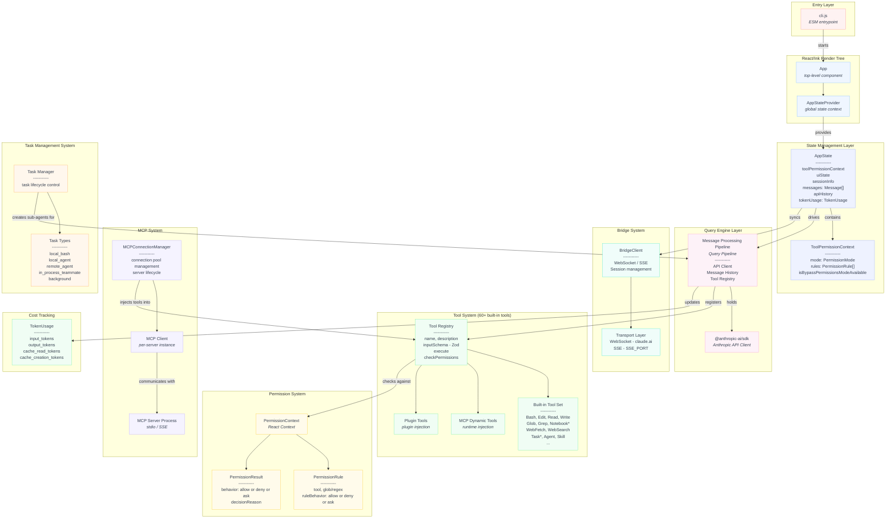
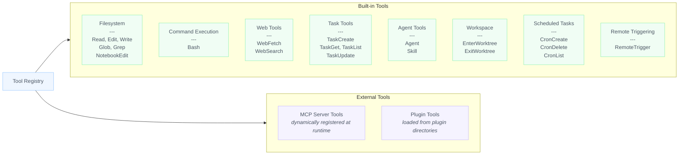
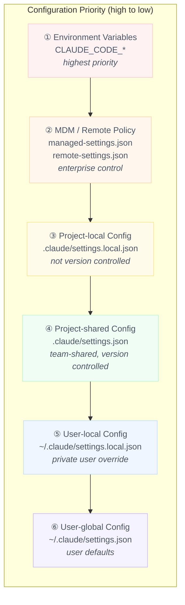
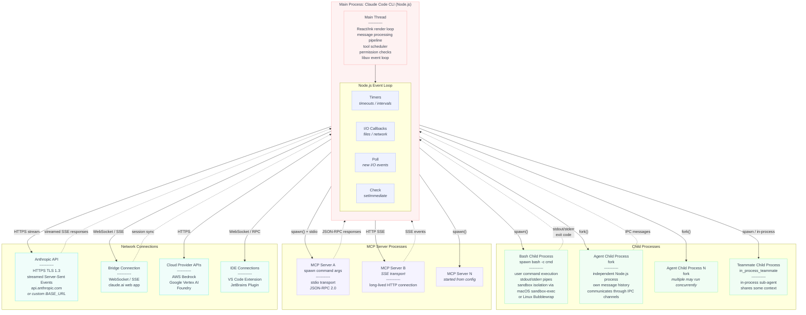
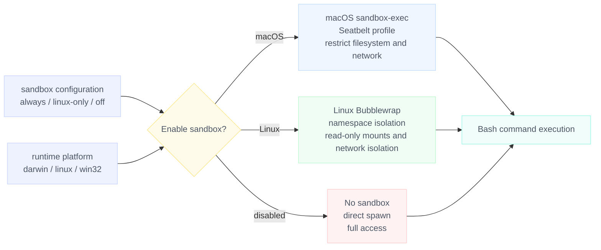
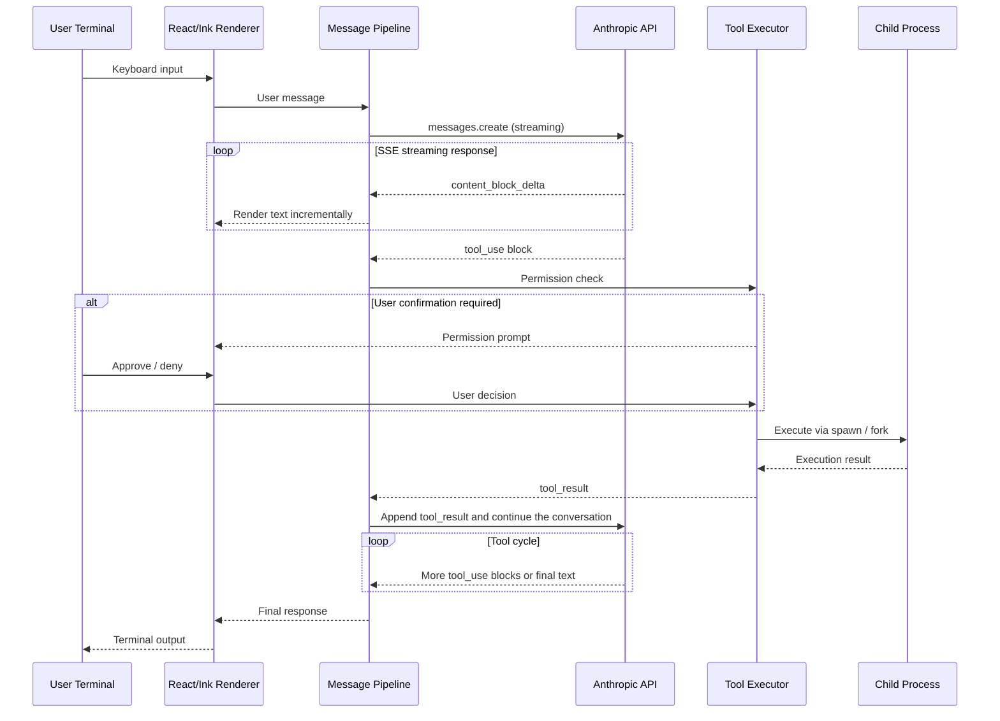

<p align="right"><a href="../cn/02_architecture.md">中文</a></p>

# Phase 2: Overall Architecture Analysis

> This chapter offers a full architectural analysis of Claude Code CLI (`@anthropic-ai/claude-code` v2.1.x), covering runtime object relationships, the configuration system, and the process/thread topology.


## 1. Runtime Object Diagram

Claude Code uses a **React/Ink terminal UI plus a single-process event loop** architecture. The diagram below shows ownership, references, and dependency relationships among the core runtime objects.

### 1.1 Global Object Relationship Overview



### 1.2 Relationship Notes

| Object | Responsibility | Lifetime |
|------|------|----------|
| `App` | Top-level React/Ink component that mounts all providers | Process lifetime |
| `AppStateProvider` | Passes global state downward through React Context | Same as `App` |
| `AppState` | Global mutable state container for message history, permission context, UI state, session info, and token usage | Same as `App` |
| `ToolPermissionContext` | Permission mode and rule set embedded inside `AppState` | Same as `AppState` |
| Query Pipeline | Message-processing pipeline: receives user input -> assembles request -> calls API -> parses streamed response -> schedules tool execution | Per conversation turn |
| `@anthropic-ai/sdk` | Official Anthropic SDK responsible for HTTP communication and stream parsing | Same as the query pipeline |
| Tool Registry | Central registry for 60+ built-in tools plus dynamic MCP tools and plugin tools | Process lifetime |
| `PermissionContext` | React Context that exposes permission-checking to the tool system | Same as `App` |
| `BridgeClient` | Client for bidirectional communication with claude.ai | Created and destroyed on demand |
| `MCPConnectionManager` | Manages the lifecycle of all MCP server connections and tool injection | Process lifetime |
| Task Manager | Creates and manages subtasks such as sub-agents and background jobs | Process lifetime |
| `TokenUsage` | Tracks token consumption by category: input, output, cache reads, and cache writes | Cumulative |

### 1.3 Tool System Breakdown



Every tool object follows a common interface:

```typescript
interface Tool {
  name: string;                    // Unique tool identifier
  description: string;             // Description visible to the LLM
  inputSchema: ZodSchema;          // Zod-based input validation
  execute(input, context): Promise<ToolResult>;    // Execution logic
  checkPermissions(input, context): Promise<PermissionResult>;  // Preflight permission check
  requiresUserInteraction?(): boolean;  // Whether user interaction is required
}
```


## 2. Configuration Matrix

Claude Code uses a multi-layer, multi-source configuration merge system. Configuration is layered from highest to lowest priority, and higher-priority fields override lower-priority values with the same name.

### 2.1 Configuration Loading Order



| Priority | Source | Path | Purpose |
|--------|----------|------|------|
| 1 (highest) | Environment variables | `CLAUDE_CODE_*` | Override all other configuration at runtime |
| 2 | MDM policy | `managed-settings.json` / `remote-settings.json` | Centralized enterprise control |
| 3 | Project-local | `.claude/settings.local.json` | Developer-specific settings for the current project, not committed to Git |
| 4 | Project-shared | `.claude/settings.json` | Team-agreed project settings, committed to Git |
| 5 | User-local | `~/.claude/settings.local.json` | Private per-user overrides |
| 6 (lowest) | User-global | `~/.claude/settings.json` | User default settings |

In addition, the CLI parameters `--settings <file-or-json>` and `--setting-sources` provide further control over loading behavior.

### 2.2 Key Configuration Fields

```json
{
  "sandbox": "linux-only | always | off",
  "toolPermissionMode": "default | acceptEdits | bypassPermissions | plan | dontAsk | auto",
  "hooks": {
    "PreToolUse": [...],
    "PostToolUse": [...],
    "Notification": [...],
    "Stop": [...],
    "SessionEnd": [...]
  },
  "plugins": ["plugin-name-or-path"],
  "memory": {
    "enabled": true
  },
  "effort": "low | medium | high | max",
  "allowedTools": ["Bash(git:*)", "Edit", "Read"],
  "disallowedTools": ["WebFetch"],
  "mcpServers": {
    "server-name": {
      "command": "npx",
      "args": ["-y", "@modelcontextprotocol/server-xxx"],
      "env": {}
    }
  }
}
```

### 2.3 Environment Variable Matrix

Claude Code recognizes **200+ environment variables**, grouped by functional area as follows.

#### 2.3.1 Core Authentication and API

| Environment Variable | Description |
|----------|------|
| `ANTHROPIC_API_KEY` | Anthropic direct API key |
| `ANTHROPIC_AUTH_TOKEN` | Authentication token |
| `ANTHROPIC_BASE_URL` | Base API URL for custom endpoints |
| `ANTHROPIC_MODEL` | Global model override |
| `ANTHROPIC_SMALL_FAST_MODEL` | Lightweight model override for sub-agents and similar scenarios |
| `ANTHROPIC_LOG` | SDK log level |
| `ANTHROPIC_BETAS` | Beta feature headers |
| `ANTHROPIC_CUSTOM_HEADERS` | Custom HTTP headers |
| `ANTHROPIC_UNIX_SOCKET` | Unix-socket connection |

#### 2.3.2 Multi-cloud Providers

| Environment Variable | Description |
|----------|------|
| `ANTHROPIC_BEDROCK_BASE_URL` | AWS Bedrock endpoint |
| `ANTHROPIC_FOUNDRY_BASE_URL` | Foundry endpoint |
| `ANTHROPIC_FOUNDRY_API_KEY` | Foundry API key |
| `ANTHROPIC_FOUNDRY_AUTH_TOKEN` | Foundry authentication token |
| `ANTHROPIC_FOUNDRY_RESOURCE` | Foundry resource identifier |
| `ANTHROPIC_SMALL_FAST_MODEL_AWS_REGION` | AWS region for the lightweight Bedrock model |
| `CLAUDE_CODE_USE_BEDROCK` | Enable AWS Bedrock |
| `CLAUDE_CODE_USE_VERTEX` | Enable Google Vertex AI |
| `CLAUDE_CODE_USE_FOUNDRY` | Enable Foundry |
| `CLAUDE_CODE_SKIP_BEDROCK_AUTH` | Skip Bedrock authentication |
| `CLAUDE_CODE_SKIP_VERTEX_AUTH` | Skip Vertex authentication |
| `CLAUDE_CODE_SKIP_FOUNDRY_AUTH` | Skip Foundry authentication |

#### 2.3.3 Model Configuration

| Environment Variable | Description |
|----------|------|
| `ANTHROPIC_DEFAULT_SONNET_MODEL` | Default Sonnet model ID |
| `ANTHROPIC_DEFAULT_SONNET_MODEL_NAME` | Sonnet display name |
| `ANTHROPIC_DEFAULT_SONNET_MODEL_DESCRIPTION` | Sonnet description |
| `ANTHROPIC_DEFAULT_SONNET_MODEL_SUPPORTED_CAPABILITIES` | Sonnet capability declaration |
| `ANTHROPIC_DEFAULT_OPUS_MODEL` | Default Opus model ID |
| `ANTHROPIC_DEFAULT_OPUS_MODEL_NAME` / `_DESCRIPTION` / `_SUPPORTED_CAPABILITIES` | Opus model metadata |
| `ANTHROPIC_DEFAULT_HAIKU_MODEL` | Default Haiku model ID |
| `ANTHROPIC_DEFAULT_HAIKU_MODEL_NAME` / `_DESCRIPTION` / `_SUPPORTED_CAPABILITIES` | Haiku model metadata |
| `ANTHROPIC_CUSTOM_MODEL_OPTION` | Custom model ID |
| `ANTHROPIC_CUSTOM_MODEL_OPTION_NAME` / `_DESCRIPTION` | Custom model metadata |
| `CLAUDE_CODE_SUBAGENT_MODEL` | Dedicated model for sub-agents |

#### 2.3.4 OAuth and Account

| Environment Variable | Description |
|----------|------|
| `CLAUDE_CODE_OAUTH_TOKEN` | OAuth token |
| `CLAUDE_CODE_OAUTH_TOKEN_FILE_DESCRIPTOR` | OAuth token file descriptor |
| `CLAUDE_CODE_OAUTH_REFRESH_TOKEN` | OAuth refresh token |
| `CLAUDE_CODE_OAUTH_CLIENT_ID` | OAuth client ID |
| `CLAUDE_CODE_OAUTH_SCOPES` | OAuth scopes |
| `CLAUDE_CODE_CUSTOM_OAUTH_URL` | Custom OAuth URL |
| `CLAUDE_CODE_ORGANIZATION_UUID` | Organization UUID |
| `CLAUDE_CODE_ACCOUNT_UUID` | Account UUID |
| `CLAUDE_CODE_ACCOUNT_TAGGED_ID` | Tagged account ID |
| `CLAUDE_CODE_USER_EMAIL` | User email |
| `CLAUDE_CODE_TEAM_NAME` | Team name |

#### 2.3.5 Runtime Behavior Controls

| Environment Variable | Description |
|----------|------|
| `CLAUDE_CODE_MAX_OUTPUT_TOKENS` | Maximum output tokens |
| `CLAUDE_CODE_MAX_RETRIES` | Maximum API retries |
| `CLAUDE_CODE_MAX_TOOL_USE_CONCURRENCY` | Upper bound for concurrent tool execution |
| `CLAUDE_CODE_EFFORT_LEVEL` | Reasoning effort level |
| `CLAUDE_CODE_AUTO_COMPACT_WINDOW` | Threshold for automatic context compaction |
| `CLAUDE_CODE_IDLE_THRESHOLD_MINUTES` | Idle timeout threshold in minutes |
| `CLAUDE_CODE_IDLE_TOKEN_THRESHOLD` | Idle-token threshold |
| `CLAUDE_CODE_STALL_TIMEOUT_MS_FOR_TESTING` | Stall timeout |
| `CLAUDE_CODE_SLOW_OPERATION_THRESHOLD_MS` | Slow-operation threshold |
| `CLAUDE_CODE_BLOCKING_LIMIT_OVERRIDE` | Blocking-limit override |
| `CLAUDE_CODE_FILE_READ_MAX_OUTPUT_TOKENS` | Max tokens for file-read output |
| `CLAUDE_CODE_RESUME_INTERRUPTED_TURN` | Resume an interrupted conversation turn |

#### 2.3.6 Feature Flags (`DISABLE_*`)

| Environment Variable | Description |
|----------|------|
| `CLAUDE_CODE_DISABLE_ADAPTIVE_THINKING` | Disable adaptive thinking |
| `CLAUDE_CODE_DISABLE_ADVISOR_TOOL` | Disable the Advisor tool |
| `CLAUDE_CODE_DISABLE_ATTACHMENTS` | Disable attachments |
| `CLAUDE_CODE_DISABLE_AUTO_MEMORY` | Disable automatic memory |
| `CLAUDE_CODE_DISABLE_BACKGROUND_TASKS` | Disable background tasks |
| `CLAUDE_CODE_DISABLE_CLAUDE_MDS` | Disable automatic `CLAUDE.md` discovery |
| `CLAUDE_CODE_DISABLE_COMMAND_INJECTION_CHECK` | Disable command-injection checks |
| `CLAUDE_CODE_DISABLE_CRON` | Disable cron jobs |
| `CLAUDE_CODE_DISABLE_EXPERIMENTAL_BETAS` | Disable experimental betas |
| `CLAUDE_CODE_DISABLE_FAST_MODE` | Disable fast mode |
| `CLAUDE_CODE_DISABLE_FEEDBACK_SURVEY` | Disable feedback surveys |
| `CLAUDE_CODE_DISABLE_FILE_CHECKPOINTING` | Disable file checkpointing |
| `CLAUDE_CODE_DISABLE_GIT_INSTRUCTIONS` | Disable Git instructions |
| `CLAUDE_CODE_DISABLE_MOUSE` | Disable mouse support |
| `CLAUDE_CODE_DISABLE_NONESSENTIAL_TRAFFIC` | Disable non-essential network traffic |
| `CLAUDE_CODE_DISABLE_NONSTREAMING_FALLBACK` | Disable non-streaming fallback |
| `CLAUDE_CODE_DISABLE_TERMINAL_TITLE` | Disable terminal-title updates |
| `CLAUDE_CODE_DISABLE_THINKING` | Disable thinking mode |
| `CLAUDE_CODE_DISABLE_VIRTUAL_SCROLL` | Disable virtual scrolling |
| `CLAUDE_CODE_DISABLE_POLICY_SKILLS` | Disable policy skills |

#### 2.3.7 Bridge / Remote / Network

| Environment Variable | Description |
|----------|------|
| `CLAUDE_CODE_REMOTE` | Remote-mode flag |
| `CLAUDE_CODE_REMOTE_ENVIRONMENT_TYPE` | Remote environment type |
| `CLAUDE_CODE_REMOTE_MEMORY_DIR` | Remote memory directory |
| `CLAUDE_CODE_REMOTE_SESSION_ID` | Remote session ID |
| `CLAUDE_CODE_REMOTE_SEND_KEEPALIVES` | Remote keepalive toggle |
| `CLAUDE_CODE_SSE_PORT` | SSE port |
| `CLAUDE_CODE_WEBSOCKET_AUTH_FILE_DESCRIPTOR` | WebSocket auth file descriptor |
| `CLAUDE_CODE_SESSION_ACCESS_TOKEN` | Session access token |
| `CLAUDE_CODE_HOST_HTTP_PROXY_PORT` | HTTP proxy port |
| `CLAUDE_CODE_HOST_SOCKS_PROXY_PORT` | SOCKS proxy port |
| `CLAUDE_CODE_PROXY_RESOLVES_HOSTS` | Whether the proxy resolves hostnames |
| `CLAUDE_CODE_CLIENT_CERT` | Client certificate |
| `CLAUDE_CODE_CLIENT_KEY` | Client private key |
| `CCR_UPSTREAM_PROXY_ENABLED` | Upstream proxy enabled |
| `CCR_OAUTH_TOKEN_FILE` | CCR OAuth token file |

#### 2.3.8 IDE / Container / Plugins

| Environment Variable | Description |
|----------|------|
| `CLAUDE_CODE_AUTO_CONNECT_IDE` | Auto-connect to the IDE |
| `CLAUDE_CODE_IDE_HOST_OVERRIDE` | IDE host override |
| `CLAUDE_CODE_IDE_SKIP_AUTO_INSTALL` | Skip automatic IDE install |
| `CLAUDE_CODE_CONTAINER_ID` | Container ID |
| `CLAUDE_CODE_ENVIRONMENT_KIND` | Environment kind |
| `CLAUDE_CODE_HOST_PLATFORM` | Host platform |
| `CLAUDE_CODE_PLUGIN_CACHE_DIR` | Plugin cache directory |
| `CLAUDE_CODE_PLUGIN_SEED_DIR` | Plugin seed directory |
| `CLAUDE_CODE_PLUGIN_GIT_TIMEOUT_MS` | Plugin Git timeout |
| `CLAUDE_CODE_PLUGIN_USE_ZIP_CACHE` | Use ZIP cache for plugins |
| `CLAUDE_CODE_SYNC_PLUGIN_INSTALL` | Install plugins synchronously |

#### 2.3.9 Debugging / Telemetry / Observability

| Environment Variable | Description |
|----------|------|
| `CLAUDE_CODE_DEBUG_LOG_LEVEL` | Debug log level |
| `CLAUDE_CODE_DEBUG_LOGS_DIR` | Debug log directory |
| `CLAUDE_CODE_DEBUG_REPAINTS` | Debug repainting |
| `CLAUDE_CODE_DIAGNOSTICS_FILE` | Diagnostics file |
| `CLAUDE_CODE_COMMIT_LOG` | Commit log |
| `CLAUDE_CODE_ENABLE_TELEMETRY` | Enable telemetry |
| `CLAUDE_CODE_ENHANCED_TELEMETRY_BETA` | Enhanced telemetry beta |
| `CLAUDE_CODE_DATADOG_FLUSH_INTERVAL_MS` | Datadog flush interval |
| `CLAUDE_CODE_OTEL_FLUSH_TIMEOUT_MS` | OpenTelemetry flush timeout |
| `CLAUDE_CODE_OTEL_HEADERS_HELPER_DEBOUNCE_MS` | OTEL headers-helper debounce |
| `CLAUDE_CODE_OTEL_SHUTDOWN_TIMEOUT_MS` | OTEL shutdown timeout |
| `CLAUDE_CODE_PERFETTO_TRACE` | Perfetto tracing |
| `CLAUDE_CODE_FRAME_TIMING_LOG` | Frame timing log |
| `CLAUDE_CODE_PROFILE_QUERY` | Query profiling |
| `CLAUDE_CODE_PROFILE_STARTUP` | Startup profiling |

### 2.4 CLI Argument Matrix

The following are the core `claude` CLI arguments, grouped by usage scenario.

#### Session Control

| Argument | Description |
|------|------|
| `[prompt]` | Pass a prompt directly on the command line |
| `-p, --print` | Non-interactive mode: print output and exit, useful for pipelines |
| `-c, --continue` | Continue the most recent session in the current directory |
| `-r, --resume [id]` | Resume by session ID or choose interactively |
| `--session-id <uuid>` | Specify the session UUID |
| `--fork-session` | Create a new session when resuming, without modifying the original |
| `--from-pr [value]` | Resume a session associated with a Pull Request |
| `-n, --name <name>` | Set the display name for the session |

#### Models and Reasoning

| Argument | Description |
|------|------|
| `--model <model>` | Select a model, either by alias such as `sonnet` / `opus` or full ID |
| `--fallback-model <model>` | Fallback model under overload, only in `--print` mode |
| `--effort <level>` | Reasoning effort: `low`, `medium`, `high`, `max` |
| `--betas <betas...>` | Beta feature headers |
| `--max-budget-usd <amount>` | Maximum spend in USD, only in `--print` mode |

#### Input / Output Formatting

| Argument | Description |
|------|------|
| `--output-format <format>` | Output format: `text`, `json`, `stream-json` |
| `--input-format <format>` | Input format: `text`, `stream-json` |
| `--json-schema <schema>` | JSON Schema for structured output |
| `--verbose` | Verbose output mode |
| `--include-partial-messages` | Include partial message streams |

#### Permissions and Safety

| Argument | Description |
|------|------|
| `--permission-mode <mode>` | Permission mode: `default`, `acceptEdits`, `bypassPermissions`, `plan`, `dontAsk`, `auto` |
| `--dangerously-skip-permissions` | Skip all permission checks, sandbox-only |
| `--allow-dangerously-skip-permissions` | Allow skipping permissions as an explicit option rather than a default |
| `--allowedTools <tools...>` | Tool allowlist |
| `--disallowedTools <tools...>` | Tool denylist |
| `--tools <tools...>` | Explicitly select available tools; `\"\"` disables all tools |

#### System Prompt and Context

| Argument | Description |
|------|------|
| `--system-prompt <prompt>` | Override the system prompt |
| `--append-system-prompt <prompt>` | Append content after the default system prompt |
| `--add-dir <directories...>` | Add directories that tools may access |
| `--file <specs...>` | Download file resources at startup |

#### MCP and Plugins

| Argument | Description |
|------|------|
| `--mcp-config <configs...>` | Load MCP server configuration |
| `--strict-mcp-config` | Use only MCP configuration passed through `--mcp-config` |
| `--plugin-dir <path>` | Load a plugin directory; repeatable |

#### Agents and Automation

| Argument | Description |
|------|------|
| `--agent <agent>` | Choose the agent for this session |
| `--agents <json>` | Define custom agents in JSON |
| `--agent-teams` | Enable agent teams |
| `--brief` | Enable the `SendUserMessage` tool |
| `--bare` | Minimal mode: skip hooks, LSP, plugin sync, and more |

#### Workspace and Environment

| Argument | Description |
|------|------|
| `-w, --worktree [name]` | Create a Git worktree for the session |
| `--tmux` | Create a tmux session for the worktree |
| `--settings <file-or-json>` | Load an additional settings file |
| `--setting-sources <sources>` | Restrict which setting sources are loaded |
| `--chrome` / `--no-chrome` | Enable or disable Chrome integration |
| `--ide` | Auto-connect to the IDE |
| `-d, --debug [filter]` | Debug mode |
| `-v, --version` | Show version |
| `-h, --help` | Show help |

#### Subcommands

| Subcommand | Description |
|--------|------|
| `auth` | Authentication management |
| `mcp` | MCP server configuration management |
| `plugin` / `plugins` | Plugin management |
| `agents` | List configured agents |
| `auto-mode` | Inspect auto-mode classifier configuration |
| `doctor` | Health checks |
| `install [target]` | Install native build artifacts |
| `setup-token` | Configure a long-lived auth token |
| `update` / `upgrade` | Check for and install updates |


## 3. Process and Thread Topology

Claude Code is a **single-main-process** Node.js application that expands into a multi-process, multi-connection runtime topology through `fork()`, `spawn()`, and network I/O.

### 3.1 Full Process / Thread Topology



### 3.2 Process Communication Matrix

| Communication Path | Protocol | Data Format | Direction | Blocking |
|----------|------|----------|------|--------|
| Main process -> Bash child | `spawn()` stdio pipes | Raw UTF-8 text | Bidirectional (`stdin`/`stdout`/`stderr`) | Async non-blocking |
| Main process -> Agent child | `fork()` IPC channel | Node.js IPC messages (structured clone) | Bidirectional | Async non-blocking |
| Main process -> MCP server (stdio) | `spawn()` + JSON-RPC 2.0 | Line-delimited JSON | Bidirectional | Async non-blocking |
| Main process -> MCP server (SSE) | HTTP SSE | JSON event stream | One-way push plus HTTP requests | Async non-blocking |
| Main process -> Anthropic API | HTTPS + SSE | JSON streamed through Server-Sent Events | Request + streamed response | Async non-blocking |
| Main process -> Bridge | WebSocket / SSE | JSON message frames | Bidirectional | Async non-blocking |
| Main process -> IDE | WebSocket / JSON-RPC | JSON messages | Bidirectional | Async non-blocking |

### 3.3 Bash Sandbox Isolation



### 3.4 Task Types and Execution Models

| Task Type | Process Model | Description |
|----------|----------|------|
| `local_bash` | `spawn()` child process | Executes local shell commands, optionally inside a sandbox |
| `local_agent` | `fork()` child process | Local sub-agent running as an independent Node.js process with its own message history |
| `remote_agent` | HTTP connection | Remote agent accessed through a network API |
| `in_process_teammate` | In-process execution | In-process sub-agent that shares some context but keeps separate conversation turns |
| `background` | In-process async work | Background jobs that do not block the main conversation flow |

### 3.5 End-to-end Data Flow




## Appendix: Architectural Takeaways

### Single-process, Event-driven Core

Claude Code chooses a single-process Node.js architecture with an event loop rather than a multi-threaded model. All I/O, including API calls, filesystem access, and child-process communication, is asynchronous and non-blocking. React/Ink handles declarative terminal rendering, with `useState` and `useEffect` driving UI updates from state.

### Extensible Tool System

Built-in tools, MCP tools, and plugin tools are all registered into the Tool Registry through a unified `Tool` interface. MCP allows third-party tools to be injected dynamically at runtime without modifying Claude Code's own source.

### Multi-layer Configuration Merging

Six configuration layers are merged by priority. This supports both centralized enterprise control through MDM policies and per-developer local overrides. Environment variables sit at the highest priority, which keeps CI/CD and containerized deployments flexible.

### Defense in Depth for Permissions

Permission checks run across the full tool-execution lifecycle: configuration rules (allowlists / denylists) -> a tool's own `checkPermissions()` -> global permission mode -> user confirmation. Bash commands go through an extra sandboxing layer using macOS `sandbox-exec` or Linux Bubblewrap.

### Bridge and Multi-surface Collaboration

`BridgeClient` maintains bidirectional communication with the claude.ai web app over WebSocket or SSE, enabling real-time session synchronization between terminal and web and allowing seamless switching across surfaces.
