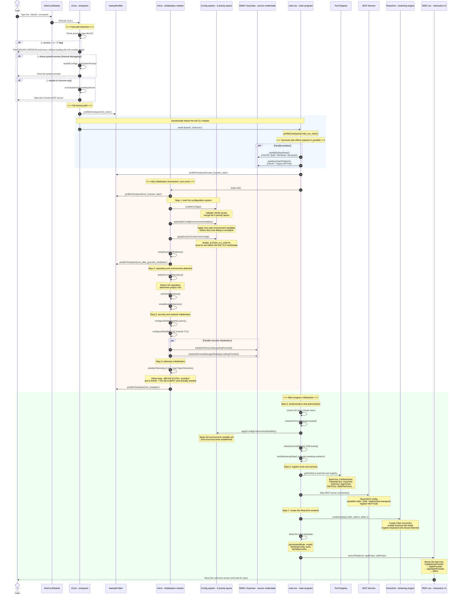
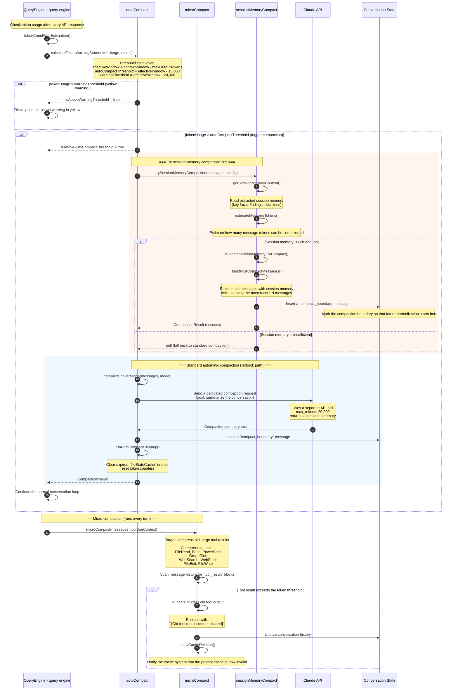

<p align="right"><a href="../cn/03_workflow.md">中文</a></p>

# Phase 3: Workflow Analysis

## Scenario Selection

The Claude Code CLI workflow revolves around two core scenarios:

| No. | Scenario | Description |
|------|------|------|
| 1 | **Startup and Initialization** | Covers the path from the user typing `claude` to the REPL becoming ready, including configuration loading, credential validation, and UI-renderer setup |
| 2 | **Interactive Conversation Loop with Tool Use** | The complete feedback loop of user input -> API call -> stream parsing -> tool execution -> result feedback, which forms the system's core runtime loop |

These two scenarios matter because Scenario 1 determines startup performance and configuration correctness, while Scenario 2 is where users spend 99% of their time. Tool invocation and permission checks inside that loop are what fundamentally distinguish Claude Code from a generic chat-oriented CLI.


## Scenario 1: Startup and Initialization

### Overview

Startup proceeds through staged loading from the shell to the Node.js entrypoint, then into initialization, the main program, and finally the React/Ink render tree. The design deliberately separates fast paths such as `--version` from the full initialization path so that trivial commands can return with near-zero latency.

### Detailed Sequence Diagram



### Configuration Priority During Startup (6 Layers)

During startup, `enableConfigs()` merges configuration in the following order, from highest to lowest priority:

```
1. Environment variable overrides   (CLAUDE_CODE_*)
2. CLI arguments                    (--model, --permission-mode, ...)
3. Project-level configuration      (.claude/settings.json, .claude/settings.local.json)
4. User-level configuration         (~/.claude/settings.json)
5. Enterprise MDM policy            (macOS: com.anthropic.claude-code, Windows: Registry)
6. Remote managed settings
```

### Startup Performance Optimizations

| Optimization Strategy | Implementation | Effect |
|----------|----------|------|
| Zero-load fast path | `--version` prints directly without importing the full module graph | ~0 ms response |
| Parallel side effects | Start MDM reads and keychain prefetch in parallel around module import | Saves about 65 ms on macOS |
| Lazy loading | Delay-load OpenTelemetry (~400 KB) and gRPC (~700 KB) until actually needed | Reduces initial memory footprint |
| Memoized init | `init()` is wrapped with `lodash memoize`, guaranteeing a single execution | Avoids duplicated initialization |
| `profileCheckpoint` | End-to-end timing checkpoints available via `--profile` | Improves observability |


## Scenario 2: Interactive Conversation Loop (Core Loop)

### Overview

The conversation loop is the heart of Claude Code. Each user input goes through a full cycle of **message normalization -> system-prompt construction -> streamed API call -> streamed response parsing -> tool invocation / permission checks / execution -> result feedback**. When Claude's response contains tool calls, the resulting tool outputs are fed back into the API to trigger the next loop iteration. This repeats until Claude returns a final plain-text answer with no further tool use.

### Detailed Sequence Diagram



```mermaid
sequenceDiagram
    autonumber
    actor User as User
    participant REPL as REPL.tsx - interactive UI
    participant QE as QueryEngine - query engine
    participant Msg as Message normalization - messages.ts
    participant Ctx as Context builder - queryContext.ts
    participant API as Claude API - streaming call
    participant Stream as Stream parser - query.ts
    participant STE as StreamingToolExecutor
    participant Perm as Permission system - 5 modes
    participant Hooks as Hook system
    participant Tool as Tool instance - BashTool etc.
    participant Compact as Compaction system

    User->>REPL: Enter text + press Enter
    Note over REPL: Ink PromptInput collects the user text

    REPL->>REPL: consumeEarlyInput()<br>(consume buffered input)

    REPL->>QE: processUserInput(text)
    Note over QE: QueryEngine.onUserMessage()

    rect rgb(240, 248, 255)
        Note over QE,Msg: === Phase 1: message preprocessing ===

        QE->>QE: processUserInput()<br>parse slash command vs plain text
        QE->>QE: createUserMessage(text)

        QE->>Msg: normalizeMessagesForAPI(messages)
        Note over Msg: 1. Remove tool-search fields<br>2. Filter invisible messages<br>3. Remove trailing orphaned thinking blocks

        QE->>Msg: ensureToolResultPairing(messages)
        Note over Msg: Ensure every tool_use has a paired tool_result<br>repair missing tool_result entries<br>with a synthesized error placeholder

        QE->>Msg: stripSignatureBlocks(messages)
        Note over Msg: Remove signature and quote blocks

        QE->>QE: Check media-item count
        Note over QE: If the API limit exceeds 100 items,<br>run stripExcessMediaItems()
    end

    rect rgb(255, 248, 240)
        Note over QE,Ctx: === Phase 2: system-prompt construction ===

        QE->>Ctx: fetchSystemPromptParts(model, tools)

        Ctx->>Ctx: Build the layered system prompt
        Note over Ctx: 1. CLI system prefix<br>   (role definition, capability description)<br>2. Tool description injection<br>   (prompt for each registered tool)<br>3. CLAUDE.md injection<br>   (project / user / enterprise levels)<br>4. Git context<br>   (repo, branch, status)<br>5. Working-directory info<br>6. OS / shell info

        QE->>QE: prependUserContext()
        Note over QE: Inject user context at the front of the message list

        QE->>QE: appendSystemContext()
        Note over QE: Append system context at the end

        QE->>QE: getAttachmentMessages()
        Note over QE: Load relevant Memory files<br>and run filterDuplicateMemoryAttachments()
    end

    rect rgb(240, 255, 240)
        Note over QE,API: === Phase 3: send the API request ===

        QE->>QE: buildQueryConfig(model)
        Note over QE: Config includes:<br>- max_tokens (computed dynamically)<br>- thinking settings<br>- temperature<br>- beta headers

        QE->>API: messages.create({ stream: true })
        Note over API: POST /v1/messages<br><br>The request body includes:<br>- model<br>- system: system-prompt array<br>- messages: conversation history<br>- tools: tool definitions<br>- stream: true<br><br>Caching strategy:<br>- cache_control: ephemeral (1h)<br>- system-prompt-level cache
    end

    rect rgb(248, 240, 255)
        Note over API,Stream: === Phase 4: handle the streamed response ===

        loop Parse the SSE stream event by event
            API-->>Stream: RawMessageStreamEvent

            alt message_start event
                Stream->>Stream: Record message.id<br>initialize usage counters
            end

            alt content_block_start (type: "text")
                Stream->>REPL: Render text incrementally
                Note over REPL: Ink updates the terminal in place
            end

            alt content_block_delta (type: "text_delta")
                Stream->>REPL: Append text fragment
            end

            alt content_block_start (type: "thinking")
                Stream->>REPL: Render the thinking trace<br>(collapsible in the UI)
            end

            alt content_block_start (type: "tool_use")
                Stream->>Stream: Tool call detected<br>record the tool_use block
                Note over Stream: Parse tool name and arguments<br>through incremental JSON assembly
            end

            alt content_block_stop
                Stream->>Stream: Finalize the current block
            end

            alt message_delta (stop_reason)
                Stream->>Stream: Record stop reason<br>(end_turn / tool_use / max_tokens)
            end

            alt message_stop
                Stream->>Stream: Stream finished
            end
        end

        Stream->>QE: Return the full AssistantMessage
        Note over QE: Record usage statistics<br>update token counters
    end

    rect rgb(255, 245, 238)
        Note over QE,Tool: === Phase 5: detect and execute tool calls ===

        QE->>QE: Check whether stop_reason === "tool_use"
        Note over QE: Parse all tool_use content blocks

        alt No tool calls (stop_reason === "end_turn")
            QE-->>REPL: Return the final text response
            REPL-->>User: Display the completed reply
        end

        Note over QE: --- Tool calls are present ---

        QE->>STE: new StreamingToolExecutor(tools, canUseTool)
        Note over STE: Concurrency policy:<br>- concurrency-safe tools may run in parallel<br>- non-concurrent tools run exclusively<br>- results are buffered in receive order, not completion order

        loop For each tool_use block
            STE->>STE: addTool(block, assistantMessage)

            STE->>Perm: canUseTool(toolName, input)

            Note over Perm: === Permission-check flow ===
            Note over Perm: Five permission modes:<br>1. default - ask every time<br>2. plan - auto-allow read-only operations<br>3. autoEdit - auto-allow file edits<br>4. fullAuto - auto-allow all operations<br>5. bypassPermissions - skip all checks

            alt User confirmation required (default / plan mode)
                Perm-->>REPL: Show permission request dialog
                REPL-->>User: [Y/n/...] confirmation prompt
                User->>REPL: User decision
                REPL->>Perm: Return the decision

                alt User denies
                    Perm-->>STE: PermissionDenied
                    STE->>QE: Generate a denied tool_result
                    Note over QE: "Permission denied"<br>is_error: true
                end
            end

            alt Permission granted
                STE->>Hooks: executePreToolHooks(toolName, input)
                Note over Hooks: onBeforeToolUse hook<br>(user-defined pre-execution logic)

                alt Hook blocks execution
                    Hooks-->>STE: hookCancelled
                    STE->>QE: Generate a hook-cancelled tool_result
                else Hook allows execution
                    Hooks-->>STE: proceed

                    STE->>Tool: tool.execute(input, context)
                    Note over Tool: Example executions:<br><br>BashTool:<br>  spawn shell -> run command<br>  -> capture stdout/stderr<br><br>FileReadTool:<br>  fs.readFile() -> return content<br><br>FileWriteTool:<br>  validate path -> write file<br>  -> return diff<br><br>GrepTool:<br>  run ripgrep -> parse matches

                    Tool-->>STE: ToolResult (content)

                    STE->>Hooks: executePostToolHooks(toolName, result)
                    Note over Hooks: onAfterToolUse hook<br>(user-defined post-execution logic)
                end
            end

            STE->>QE: yield MessageUpdate<br>(tool result message)
        end
    end

    rect rgb(245, 255, 245)
        Note over QE,API: === Phase 6: feed results back and continue ===

        QE->>QE: Build tool_result user messages
        Note over QE: Each tool result is wrapped as:<br>{type: "tool_result",<br> tool_use_id: "...",<br> content: "..."}

        QE->>QE: applyToolResultBudget()
        Note over QE: Truncate oversized tool output<br>and record content replacement

        QE->>QE: microCompact() check
        Note over QE: Micro-compact old, large tool results<br>such as old FileRead or Bash output

        QE->>QE: Check automatic compaction threshold
        Note over QE: tokenCount > autoCompactThreshold?

        alt Automatic compaction required
            QE->>Compact: autoCompact(messages)
            Note over Compact: See the "Context Compaction" section below
        end

        Note over QE: --- Continue the conversation loop ---
        QE->>QE: Return to Phase 1: message preprocessing
        Note over QE: Append tool_result messages to history<br>re-normalize -> call API again<br>until stop_reason !== "tool_use"
    end

    Note over QE,REPL: === Loop termination conditions ===
    Note over QE: stop_reason === "end_turn"<br>or stop_reason === "max_tokens"<br>or user interruption (Ctrl+C / Escape)

    QE-->>REPL: Final response + usage stats
    REPL->>REPL: Render final text
    REPL->>REPL: Display token usage / cost
    REPL->>REPL: endInteractionSpan()
    REPL-->>User: Show completed reply<br>restore input prompt >
```

### Tool Execution Concurrency Model

`StreamingToolExecutor` implements a fine-grained concurrency-control strategy:

```
┌──────────────────────────────────────────────────────┐
│              StreamingToolExecutor                  │
│                                                      │
│  Tool arrives ──┬── concurrency-safe? ─ yes ─→ run immediately in parallel
│                 │
│                 └── no ─→ wait for all parallel work to finish
│                            → run exclusively
│                            → restore parallel mode afterward
│
│  Result buffering: emit in tool-receive order, not completion order
│
│  Error handling: Bash tool failure -> siblingAbortController
│                 -> immediately terminate sibling processes
│
│  Streaming fallback: discard() -> drop all output from the failed attempt
└──────────────────────────────────────────────────────┘
```

### Message Normalization Pipeline

`normalizeMessagesForAPI()` is the critical defensive layer that keeps API calls valid. Each step in the pipeline serves a specific purpose:

| Step | Function | Purpose |
|------|------|------|
| 1 | `getMessagesAfterCompactBoundary()` | Discard history earlier than the most recent compaction boundary |
| 2 | `W68()` (`filterWhitespaceOnlyAssistant`) | Remove assistant messages that contain only whitespace |
| 3 | `$$Y()` (`fixEmptyAssistantContent`) | Repair assistant messages with empty content by injecting placeholder text |
| 4 | `D68()` (`filterOrphanedThinking`) | Remove orphaned thinking blocks that have no corresponding main content |
| 5 | `z$Y()` (`filterTrailingThinking`) | Remove trailing redundant `thinking` / `redacted_thinking` blocks |
| 6 | `KZK()` (`ensureToolResultPairing`) | **Core step**: repair missing `tool_use` / `tool_result` pairs |
| 7 | `_ZK()` (`stripAdvisorBlocks`) | Remove internal advisor-related blocks |
| 8 | `hqK()` (`stripThinkingForNonThinkingModels`) | Remove thinking blocks for models that do not support them |

### Permission Mode Comparison

```
                    Increasing permission level →
    ┌─────────┬──────────┬───────────┬──────────┬──────────────────┐
    │ default │  plan    │ autoEdit  │ fullAuto │ bypassPermissions│
    ├─────────┼──────────┼───────────┼──────────┼──────────────────┤
    │ FileRead│ auto ✓   │ auto ✓    │ auto ✓   │ auto ✓            │
    │ Grep    │ auto ✓   │ auto ✓    │ auto ✓   │ auto ✓            │
    │ Glob    │ auto ✓   │ auto ✓    │ auto ✓   │ auto ✓            │
    │ Write   │ ask user │ ask user  │ auto ✓   │ auto ✓            │
    │ Edit    │ ask user │ ask user  │ auto ✓   │ auto ✓            │
    │ Bash    │ ask user │ ask user  │ ask user │ auto ✓            │
    │ Dangerous ops │ ask user │ ask user │ ask user │ auto ✓       │
    └─────────┴──────────┴───────────┴──────────┴──────────────────┘
```


## Context Compaction Subsystem

When the accumulated token count in a conversation approaches the model's context-window limit, the compaction system intervenes automatically to prevent `prompt_too_long` errors.

### Compaction Sequence Diagram



### Compaction Strategy Comparison

| Dimension | microCompact | autoCompact | sessionMemoryCompact |
|------|-------------|-------------|---------------------|
| **Trigger timing** | After every turn | When token usage exceeds threshold | Preferred path inside autoCompact |
| **Compression target** | Individual old tool results | Entire conversation history | Extracted session memory |
| **API call required** | No, purely local | Yes, for summary generation | No, uses existing memory |
| **Compression granularity** | Tool-level | Conversation-level | Conversation-level |
| **Information loss** | Medium, mainly tool output | High, older messages are summarized away | Low, preserves key memory |
| **Performance cost** | Very low | Higher, roughly one extra API call | Low |
| **Threshold** | Based on age / token usage | `contextWindow - 13K` | Preferred before standard compaction |
| **Repeated-failure protection** | None | Stop retrying after `MAX=3` failures | Falls back if insufficient |


## Key Data-flow Summary

```
User input
  │
  ▼
┌─────────────────┐     ┌──────────────────┐     ┌──────────────────┐
│ Message         │ ──→ │ System Prompt    │ ──→ │ API Request      │
│ Normalization   │     │ Construction     │     │ Assembly         │
│                 │     │                  │     │                  │
│ • normalize     │     │ • CLI prefix     │     │ • model          │
│ • ensurePairing │     │ • CLAUDE.md      │     │ • system[]       │
│ • stripBlocks   │     │ • Git context    │     │ • messages[]     │
│ • media limit   │     │ • tool prompts   │     │ • tools[]        │
└─────────────────┘     └──────────────────┘     │ • stream: true   │
                                                  └────────┬─────────┘
                                                           │
                                                           ▼
┌─────────────────┐     ┌──────────────────┐     ┌──────────────────┐
│ Context         │ ←── │ Tool Execution   │ ←── │ Stream Parsing   │
│ Compaction      │     │ Feedback         │     │                  │
│                 │     │                  │     │                  │
│ • microCompact  │     │ • permission     │     │ • SSE parsing    │
│ • autoCompact   │     │ • hooks          │     │ • text rendering │
│ • sessionMemory │     │ • tool.execute() │     │ • tool_use detect│
│                 │     │ • tool_result    │     │ • usage tracking │
└────────┬────────┘     └──────────────────┘     └──────────────────┘
         │
         │ If stop_reason === "tool_use"
         └──────────────→ return to message normalization (loop)
         
         If stop_reason === "end_turn"
         └──────────────→ show the final response to the user
```


## Error Handling and Recovery

Error handling inside the conversation loop spans multiple layers:

| Error Type | Handling Strategy | Source Location |
|----------|----------|----------|
| API rate limit (`429`) | Exponential backoff with retry countdown | `services/api/withRetry.ts` |
| Context too long (`prompt_too_long`) | Trigger automatic compaction, then retry | `query.ts` |
| Tool execution failure | Generate a `tool_result` with `is_error: true` so the model can adapt | `StreamingToolExecutor.ts` |
| Stream interruption | Raise `FallbackTriggeredError`, then retry | `services/api/withRetry.ts` |
| User interruption (`Ctrl+C`) | Propagate an `AbortController` signal and terminate the request | `query.ts` |
| Hook execution error | Log the error without blocking the main flow, unless `preventContinuation` is set | `utils/hooks.ts` |
| Repeated compaction failures | Stop retrying after 3 attempts to avoid infinite loops | `autoCompact.ts` |
| Missing `tool_use` / `tool_result` pairing | Synthesize an error placeholder and log diagnostics | `messages.ts` |
